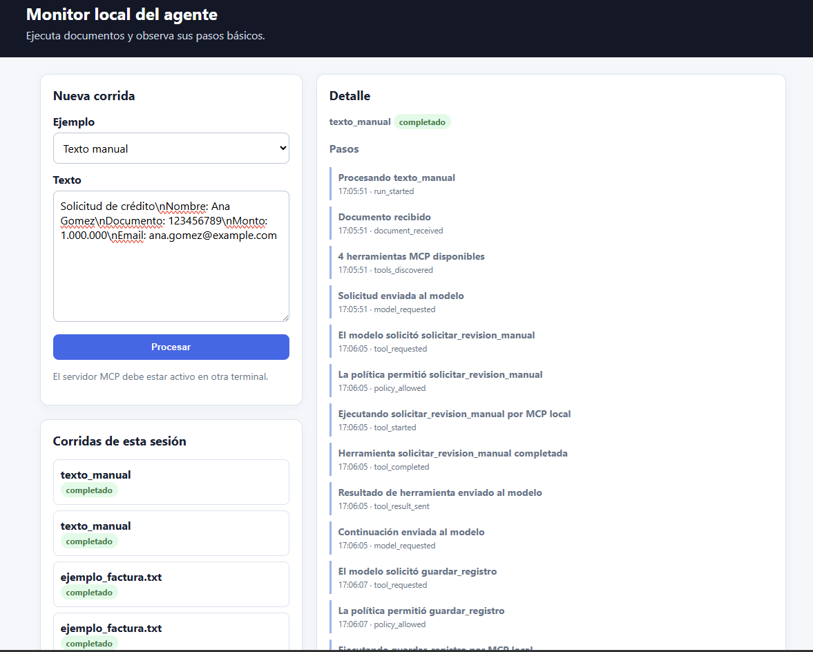
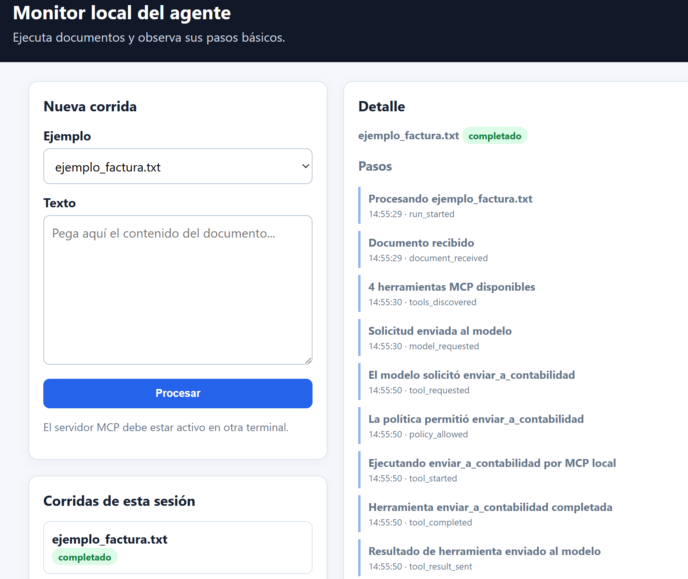
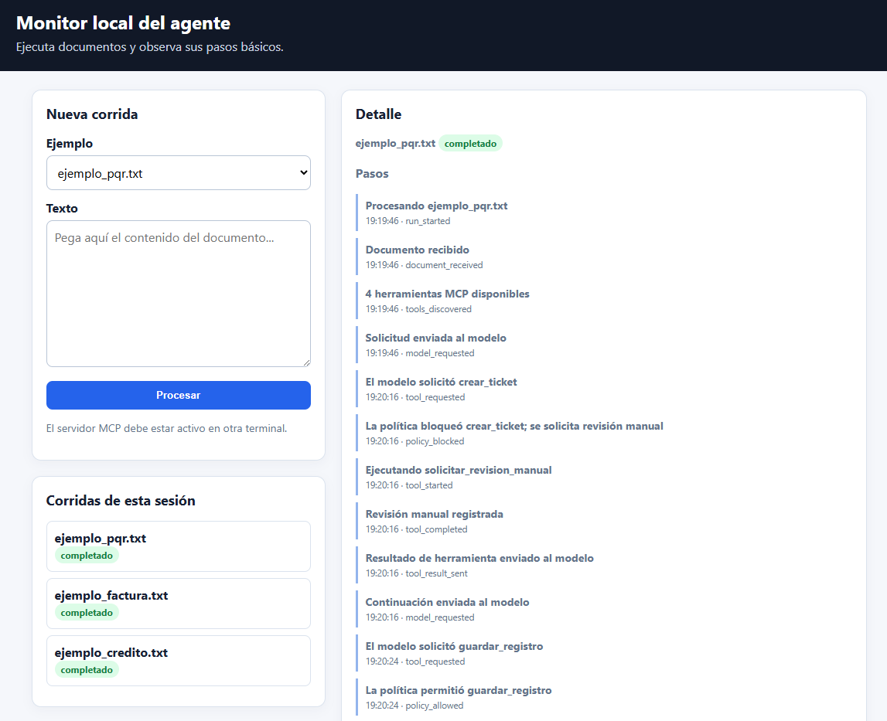
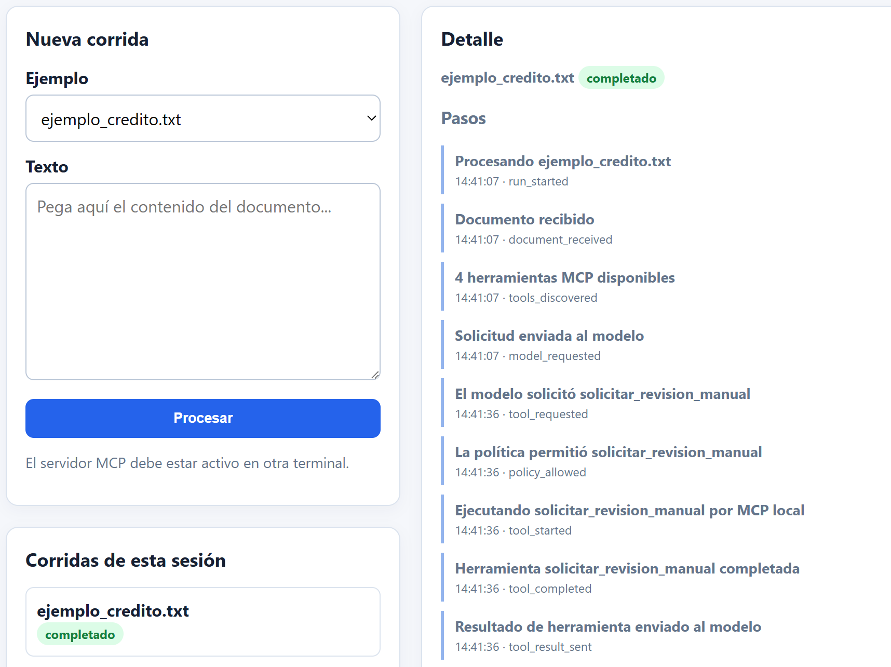
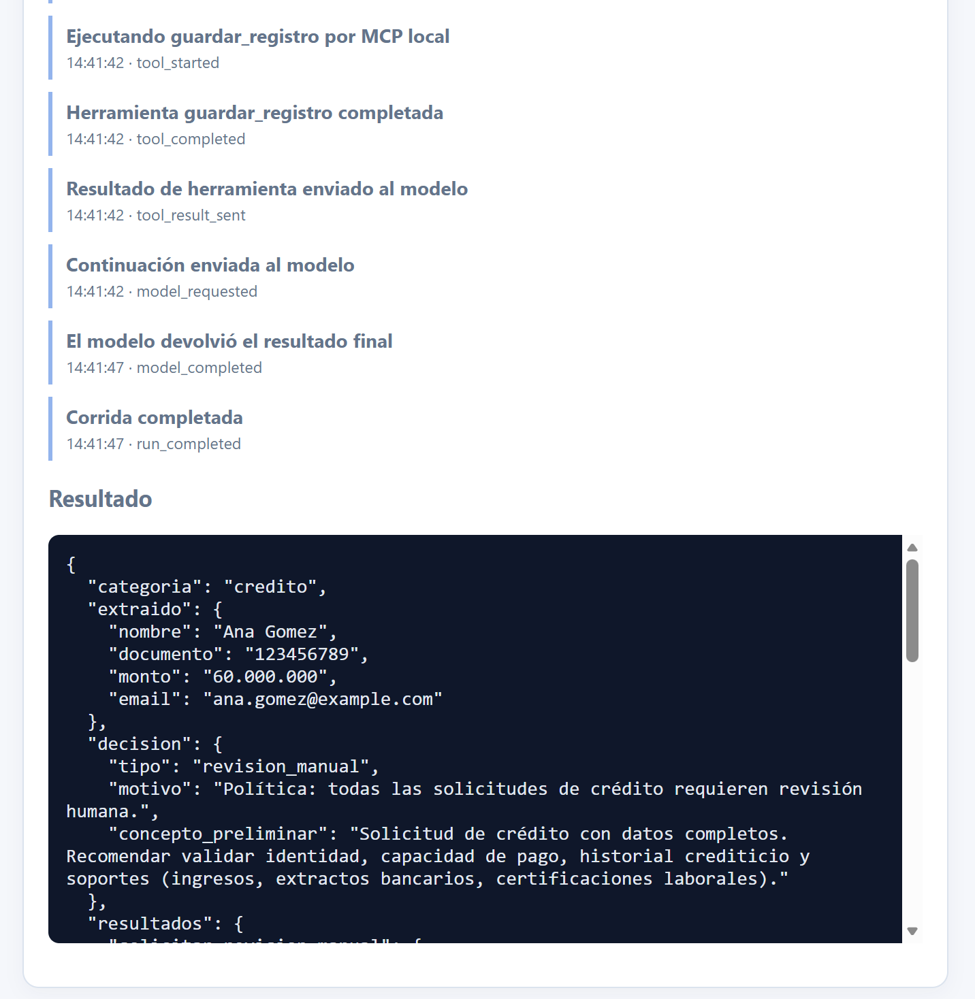
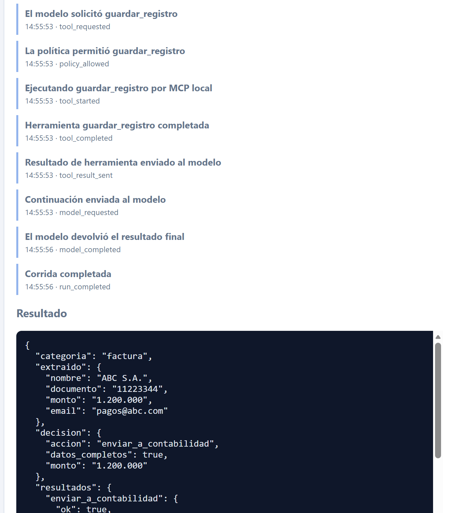
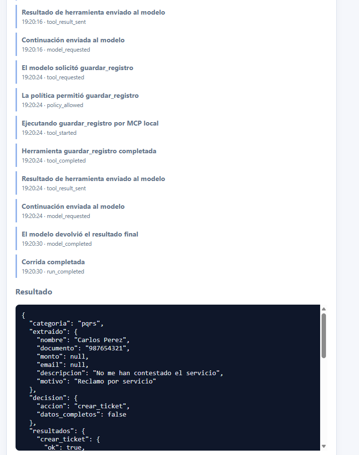
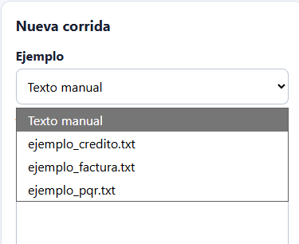

# API-Orchestrated MCP Agent

Programmatic AI agent orchestrated through the OpenAI API, with local MCP tools, deterministic execution policies and human-in-the-loop controls.

> **Repository status:** this public portfolio version reconstructs the reusable architecture of a private working implementation. It excludes organization-specific prompts, recipients, thresholds, records, credentials and operational data.

## What this project demonstrates

- A Python application that owns the complete agent execution loop.
- OpenAI Responses API for reasoning and function calling.
- A local MCP server that exposes reusable operational tools.
- Runtime discovery and conversion of MCP tools into OpenAI function tools.
- Deterministic policy checks before side-effecting actions.
- Human-review fallback for sensitive, incomplete or high-risk requests.
- Controlled tool-call limits, JSON validation and error handling.
- Optional FastAPI interface and command-line demo.
- Clear separation between model reasoning, orchestration, policy and tool execution.

## Architecture

```text
Input document or request
          |
          v
Python orchestrator
  |-- loads prompt and policies
  |-- discovers MCP tools
  |-- calls OpenAI Responses API
  |-- receives function calls
  |-- validates arguments
  |-- enforces local execution policy
          |
          v
Local MCP client
          |
          v
Local MCP server
  |-- create_task
  |-- send_notification
  |-- save_processing_record
  `-- request_human_review
```

The language model can propose actions, but it cannot execute them directly. The local orchestrator remains the final authority and may allow, block or redirect each request.

## How this differs from a client-orchestrated MCP assistant

In a desktop-client architecture, ChatGPT, Claude Desktop or another MCP-compatible client manages the reasoning loop and tool selection.

In this project, the Python application itself is the orchestrator. It calls the model API, manages the tool loop and executes approved MCP actions locally. No desktop AI client is required.

## Public demo scenario

The public version processes synthetic operational requests:

1. Classify the request.
2. Extract structured fields without inventing values.
3. Select an appropriate tool.
4. Apply deterministic policy checks.
5. Execute the tool or request human review.
6. Save a final processing record.

| Tool | Purpose |
| --- | --- |
| `create_task` | Create a local demo task for a complete, low-risk request. |
| `send_notification` | Simulate a controlled notification action. |
| `save_processing_record` | Persist a sanitized execution record locally. |
| `request_human_review` | Redirect incomplete or sensitive cases to a person. |

## Execution policy

Side-effecting tools are checked locally before execution. A request is redirected to human review when:

- Critical data is missing or unconfirmed.
- The request is marked as sensitive.
- Its numeric value reaches the configured review threshold.
- The requested tool is not included in the local allowlist.
- The maximum number of tool calls has been reached.

These controls are implemented in Python rather than relying only on prompt instructions.

## Project structure

```text
api-orchestrated-mcp-agent/
├── README.md
├── LICENSE
├── .gitignore
├── .env.example
├── requirements.txt
├── pyproject.toml
├── assets/
│   └── screenshots/
├── config/
│   ├── prompts.yaml
│   └── policies.json
├── data/
│   └── .gitkeep
├── docs/
│   ├── architecture.md
│   ├── case-study.md
│   ├── orchestration-loop.md
│   ├── security.md
│   ├── technical-decisions.md
│   ├── limitations.md
│   └── roadmap.md
├── examples/
│   ├── invoice_request.txt
│   ├── support_request.txt
│   └── sensitive_request.txt
├── src/
│   └── api_orchestrated_agent/
│       ├── __init__.py
│       ├── app.py
│       ├── config.py
│       ├── orchestrator/
│       │   ├── __init__.py
│       │   ├── agent_loop.py
│       │   ├── mcp_client.py
│       │   └── execution_policy.py
│       ├── mcp_server/
│       │   ├── __init__.py
│       │   ├── server.py
│       │   ├── records.py
│       │   ├── tasks.py
│       │   └── notifications.py
│       └── api/
│           ├── __init__.py
│           └── routes.py
├── scripts/
│   └── run_demo.py
└── tests/
    ├── test_execution_policy.py
    ├── test_orchestrator.py
    └── test_mcp_tools.py
```

## Setup

```bash
git clone https://github.com/camilocruzc3/api-orchestrated-mcp-agent.git
cd api-orchestrated-mcp-agent
python -m venv .venv
```

Activate the environment and install the package:

```bash
# Windows PowerShell
.\.venv\Scripts\Activate.ps1

# Linux or macOS
source .venv/bin/activate

pip install -e .
```

Create the environment file:

```bash
cp .env.example .env
```

Set your API key:

```env
OPENAI_API_KEY=your_api_key
```

## Run the MCP server

```bash
python -m api_orchestrated_agent.mcp_server.server
```

The local MCP endpoint is available at `http://127.0.0.1:8000/mcp` by default.

## Run the synthetic demo

Keep the MCP server running and open another terminal:

```bash
python scripts/run_demo.py support_request.txt
```

Other examples:

```bash
python scripts/run_demo.py invoice_request.txt
python scripts/run_demo.py sensitive_request.txt
```

## Run the optional HTTP API

```bash
uvicorn api_orchestrated_agent.app:app --host 127.0.0.1 --port 8080
```

Health check:

```text
GET http://127.0.0.1:8080/health
```

Process a request:

```text
POST http://127.0.0.1:8080/process
Content-Type: application/json

{
  "text": "Create a support task for this complete synthetic request.",
  "source_name": "manual-demo"
}
```

## Run the tests

```bash
python -m unittest discover -s tests -v
```

The unit tests use fake model responses and local functions, so they do not consume OpenAI tokens.

## Documentation

- [`Case study`](docs/case-study.md)
- [`Architecture`](docs/architecture.md)
- [`Orchestration loop`](docs/orchestration-loop.md)
- [`Technical decisions`](docs/technical-decisions.md)
- [`Security`](docs/security.md)
- [`Limitations`](docs/limitations.md)
- [`Roadmap`](docs/roadmap.md)

## Security and privacy

This repository intentionally excludes:

- Real business records.
- Organization-specific prompts and rules.
- Real email recipients.
- API keys and `.env` files.
- Local execution logs.
- Generated processing records.
- Private repository history.

The public notification tool is simulation-only and does not send email or messages to an external recipient.

## Prototype screenshots

The screenshots below come from the original private prototype. They use synthetic examples and demonstrate the same architectural pattern implemented in this public repository: API-based orchestration, MCP tool discovery, deterministic policy checks, human-review fallback and structured results.

The prototype used Spanish, organization-oriented tool names such as `solicitar_revision_manual`, `enviar_a_contabilidad`, `crear_ticket` and `guardar_registro`. The public implementation replaces them with generic English equivalents and simulation-only effects so the code can be shared safely.

### Local agent monitor

The monitor exposes the execution timeline, including document reception, MCP tool discovery, model requests, policy decisions and tool execution.



### Approved tool execution

This example shows a complete synthetic request for which the local policy permits the action proposed by the model and the tool is executed through MCP.



### Policy-controlled human review

This example shows the model proposing an action, the local policy blocking it and the orchestrator redirecting the case to manual review.



<details>
<summary><strong>View additional private-prototype screenshots</strong></summary>

### Human-review flow



### Human-review result



### Approved action result



### Policy-blocked result



### Prototype example selector



</details>

## Portfolio context

This project demonstrates a programmatic agent pattern in which OpenAI provides reasoning while a local Python orchestrator controls tool discovery, validation, authorization and execution through MCP.

## License

MIT License.
